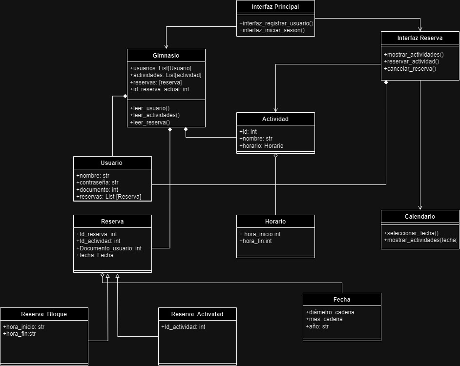

# Sistema de reserva para el gimnasio de la universidad de medellín

EL presente documento describe el diseño e implementación de un sistema de reservas para el gimnasio de la Universidad de Medellín. El objetivo general del proyecto es desarrollar el sistema de reservas del gimnasio de la universidad utilizando los principios de la programación orientada a objetos.

Dentro del proyecto no se tiene pensado llevar el aplicativo del sistema a una escala real, ya que para esto se necesitarian de conceptos aun mas avanzados que no hemos visto hasta el momento, ademas contamos con la limitación del tiempo, cosa que nos juega en contra, ya que la duración del desarrollo de un proyecto que requiere llevar la idea a la implementacion real, es bastante larga

Modelo de clases actualizado:

